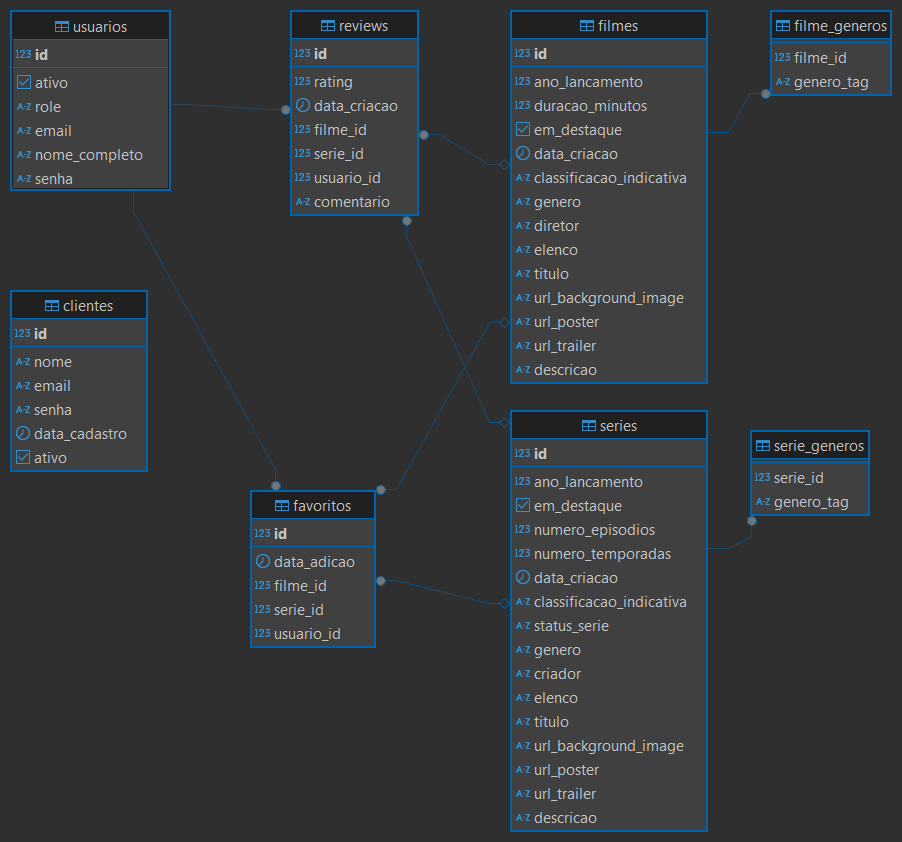
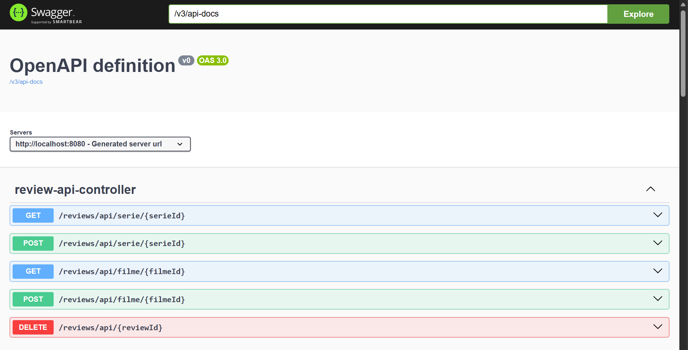

# TopFilmesBrasil - Plataforma de Reviews de Filmes e Séries
 
## 📜 Descrição

**TopFilmesBrasil** é uma aplicação web completa, desenvolvida com Spring Boot e Thymeleaf, que serve como uma plataforma para usuários descobrirem, avaliarem e favoritarem filmes e séries. O projeto conta com um sistema de autenticação robusto, painel administrativo para gerenciamento de conteúdo e usuários, e uma interface dinâmica e interativa para o usuário final.

Este projeto foi construído para demonstrar uma arquitetura MVC (Model-View-Controller) moderna, utilizando as melhores práticas do ecossistema Spring, com separação de responsabilidades, camada de serviço, DTOs e persistência de dados com JPA/Hibernate.

---

## ✨ Funcionalidades Principais

### Para Usuários
* **Autenticação de Usuários:** Sistema completo de cadastro e login.
* **Navegação e Descoberta:** Páginas dedicadas para listar todos os filmes e todas as séries disponíveis na plataforma.
* **Página Inicial Dinâmica:** Uma landing page com um carrossel de destaques, seções de "Top Avaliados" e "Novas Releases" que são populadas dinamicamente a partir do banco de dados.
* **Visualização de Detalhes:** Modais interativos que exibem informações completas sobre um filme ou série, incluindo sinopse, elenco, diretor e avaliações de outros usuários.
* **Sistema de Reviews e Avaliação:** Usuários logados podem postar comentários e dar notas (de 1 a 5 estrelas) para qualquer conteúdo.
* **Sistema de Favoritos:** Usuários logados podem adicionar e remover filmes/séries de sua lista de favoritos pessoal e visualizar sua lista em uma página dedicada.

### Para Administradores
* **Painel Administrativo:** Área restrita com funcionalidades avançadas.
* **Gerenciamento de Conteúdo:** Adição de novos filmes e séries, incluindo upload de pôsteres e banners.
* **Gerenciamento de Destaques:** Capacidade de marcar filmes e séries como "Em Destaque" para que apareçam no carrossel principal da home page.
* **Gerenciamento de Usuários:** Visualização de todos os usuários cadastrados e permissão para deletar usuários (exceto outros administradores).
* **Moderação:** Administradores podem deletar qualquer review ou conteúdo (filme/série) diretamente pela interface.

---

## 🛠️ Tecnologias Utilizadas

### Backend
* **Java 17+**
* **Spring Boot**
* **Spring Web**
* **Spring Security**
* **Spring Data JPA & Hibernate**
* **PostgreSQL**
* **Thymeleaf**
* **Maven**

### Frontend
* **HTML5**
* **CSS3** (com Variáveis)
* **JavaScript (ES6+)**

---

## 🚀 Como Executar o Projeto Localmente

Siga os passos abaixo para configurar e executar o projeto no seu ambiente de desenvolvimento.

### Pré-requisitos
* **JDK 17** ou superior.
* **PostgreSQL** instalado e em execução.
* **Maven** instalado e configurado.
* Uma **IDE** de sua preferência (ex: IntelliJ IDEA, VS Code).

### 1. Clonar o Repositório
```bash
git clone [URL_DO_REPOSITORIO_NO_GITHUB]
cd [NOME_DO_PROJETO]
```

### 2. Configurar o Banco de Dados
1.  Crie um novo banco de dados no seu PostgreSQL. Por exemplo: `topfilmes_db`.
2.  Abra o arquivo `src/main/resources/application.properties`.
3.  Configure as propriedades de conexão com o seu banco de dados:

    ```properties
    # Configuração de Conexão com o Banco de Dados PostgreSQL
    spring.datasource.url=jdbc:postgresql://localhost:5432/topfilmes_db
    spring.datasource.username=postgres
    spring.datasource.password=sua_senha_aqui

    # Configurações do Hibernate
    spring.jpa.hibernate.ddl-auto=update
    spring.jpa.show-sql=true
    spring.jpa.properties.hibernate.format_sql=true
    spring.jpa.properties.hibernate.dialect=org.hibernate.dialect.PostgreSQLDialect
    ```

### 3. Compilar e Executar
1.  Abra o projeto na sua IDE.
2.  Deixe a IDE resolver as dependências do Maven.
3.  Execute a aplicação através da sua classe principal `TopFilmesBrasilApplication.java`.

A aplicação estará disponível em `http://localhost:8080`.

---

## 🔑 Credenciais Padrão

O sistema é iniciado com dois usuários padrão, criados pelo `DataInitializer.java`:

* **Administrador:**
    * **Email:** `admin@topfilmesbrasil.com`
    * **Senha:** `admin`

* **Usuário Comum:**
    * **Email:** `user@topfilmesbrasil.com`
    * **Senha:** `user`

---

## 🏗️ Estrutura do Projeto

A estrutura do projeto segue as convenções do Spring Boot e a arquitetura MVC.

```
com.topfilmesbrasil
├── config/             # Configurações do Spring (Security, MVC, DataInitializer)
├── controller/         # Controllers para rotas web e API REST
├── dto/                # Data Transfer Objects para comunicação entre camadas
├── model/              # Entidades JPA que representam as tabelas do banco
├── repository/         # Interfaces Spring Data JPA para acesso ao banco
├── service/            # Interfaces dos serviços de negócio
│   └── impl/           # Implementações dos serviços
└── resources/
    ├── static/
    │   ├── css/        # Arquivos de estilo CSS
    │   └── js/         # Arquivos JavaScript
    └── templates/      # Arquivos HTML com Thymeleaf
        └── admin/      # Templates das páginas do painel de admin
```

---

## 🏛️ Arquitetura

O projeto utiliza uma arquitetura MVC (Model-View-Controller) com uma camada de serviço para a lógica de negócio.

* **`controller`**: Responsável por receber as requisições HTTP e direcionar para os serviços apropriados.
* **`service`**: Contém a lógica de negócio principal da aplicação.
* **`repository`**: Define a camada de acesso aos dados, usando Spring Data JPA.
* **`model`**: Representa as entidades do banco de dados (tabelas).
* **`dto`**: Objetos de Transferência de Dados, usados para comunicar de forma segura entre as camadas e com o frontend.
* **`config`**: Configurações de segurança e inicialização de dados.

---

### 🐘 Modelo do Banco de Dados

Abaixo está o diagrama entidade-relacionamento que representa a estrutura do banco de dados da aplicação.



---
## 🗺️ Endpoints da API (Exemplos)

| Método | Endpoint                      | Descrição                       | Acesso        |
|:-------|:------------------------------|:--------------------------------|:--------------|
| `POST` | `/api/signup`                 | Registra um novo usuário.       | Público       |
| `POST` | `/api/signin`                 | Autentica um usuário.           | Público       |
| `GET`  | `/admin/usuarios`             | Lista todos os usuários.        | Admin         |
|`DELETE`| `/admin/api/filmes/{id}`      | Deleta um filme.                | Admin         |
| `GET`  | `/api/favoritos`              | Lista os favoritos do usuário.  | Autenticado   |
| `POST` | `/reviews/api/filme/{id}`     | Adiciona um review a um filme.  | Autenticado   |


---

---

## 📄 Documentação da API (Swagger)

Este projeto utiliza o Springdoc (Swagger) para gerar uma documentação interativa da API REST. Com ela, é possível visualizar todos os endpoints disponíveis, seus parâmetros, os objetos que eles esperam e retornam, além de permitir o teste das requisições diretamente pelo navegador.

### Como Acessar

1.  Com a aplicação rodando localmente, acesse a seguinte URL no seu navegador:
    [http://localhost:8080/swagger-ui.html](http://localhost:8080/swagger-ui.html)

2.  Você verá uma interface onde poderá explorar e testar todos os endpoints da API.



---

## 🤝 Contribuições

Contribuições são bem-vindas! Se você encontrar um bug ou tiver uma sugestão, por favor, abra uma *issue* neste repositório.

---

## 📝 Licença

Este projeto está sob a licença MIT. Veja o arquivo `LICENSE` para mais detalhes.
```
